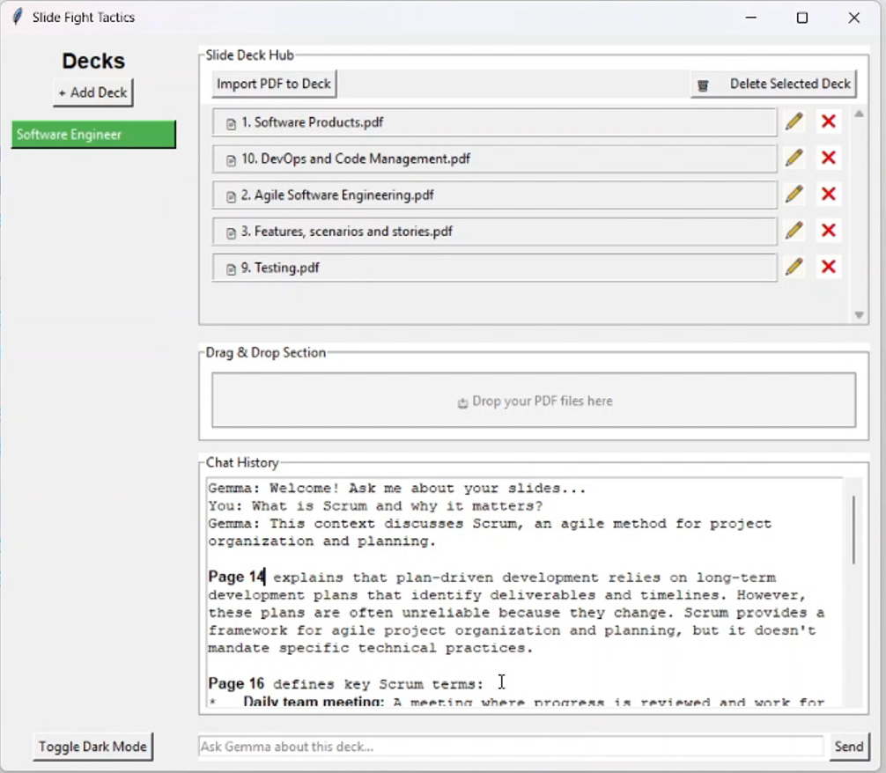

# Slide Fight Tactics 🧠📚

Slide Fight Tactics is a local-first, AI-powered slide deck assistant. Create decks, import PDF slides, and ask questions with natural language. Answers are retrieved from your slides with referenced page and slide information using Gemma 3n (via Ollama).

---

## 🧩 Features

- 📥 Import PDF slides into organized decks
- 🧠 Ask Gemma-3n (via Ollama) about your slides
- 🔍 Get accurate, page-referenced answers from your documents
- 🖥️ Simple, responsive local GUI (Tkinter)

---

## 🚀 Getting Started

Follow these steps to clone and run the project on your machine.

### 1. Clone the Repository

```bash
git clone https://github.com/haibayby2002/sft.git
cd sft
```

### 2. Set Up Python Virtual Environment (If not already installed)

Make sure Python 3.9+ is installed.

```bash
python -m venv venv
```

Activate it:

- On **Windows**:
  ```bash
  venv\Scripts\activate
  ```

- On **Linux/macOS**:
  ```bash
  source venv/bin/activate
  ```

### 3. Install Required Libraries

```bash
pip install -r requirements.txt
```

If `requirements.txt` is missing or you want to install manually:

```bash
pip install faiss-cpu PyPDF2 numpy ollama openai tk
```

---

## 🦙 Install Ollama and Gemma

### 1. Download and Install Ollama

Install Ollama from: [https://ollama.com/download](https://ollama.com/download)

Then start Ollama:

```bash
ollama serve
```

### 2. Pull Gemma 3n Model

```bash
ollama pull gemma:3n
```

Or for your specific E2B version:

```bash
ollama pull gemma3n:e2b
```

> Make sure you have at least **8GB RAM** for the model to run smoothly.

---

## 🧠 Run the Application

Once setup is done:

```bash
python main.py
```

> The GUI will launch. You can start creating decks, importing PDF slides, and chatting with Gemma right away!

---

## 📁 Project Structure

```
slide-fight-tactics/
│
├── data/                 # Database models & vector store
├── interface/            # Tkinter GUI components
├── service/              # Business logic (Gemma, embedding, etc.)
├── config/               # Configuration files
├── assets/               # Static assets (icons, images, etc.)
├── main.py               # App entry point
├── requirements.txt      # Python dependencies
└── README.md             # This file
```

---

## 🧪 Troubleshooting

- ❌ _Gemma not responding?_  
  Ensure `ollama serve` is running in the background.

- ❌ _Import works but query returns nothing?_  
  Try restarting the app. Embeddings are stored in memory + disk.

- ❌ _Markdown not rendering?_  
  Ensure you’re using the custom `SimpleMarkdownText` widget.

---

## 🧠 Credits

- [Gemma 3n](https://ollama.com/library/gemma)
- [Ollama](https://ollama.com)
- PDF parsing via [PyPDF2](https://pypi.org/project/PyPDF2/)
- Vector search using [FAISS](https://github.com/facebookresearch/faiss)

---

## 📜 License

MIT License. Feel free to fork, contribute, or use this project in your own tools.

---

## 🤝 Contribute

Pull requests and feedback are always welcome!
